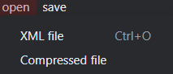
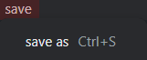
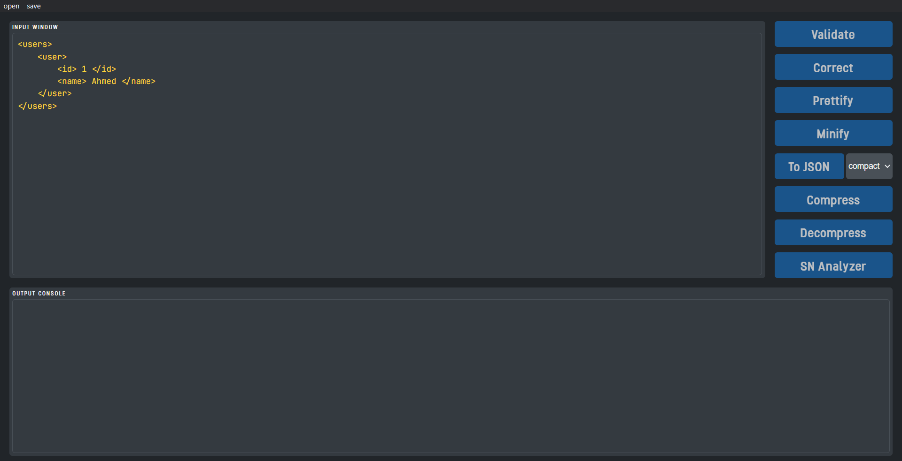
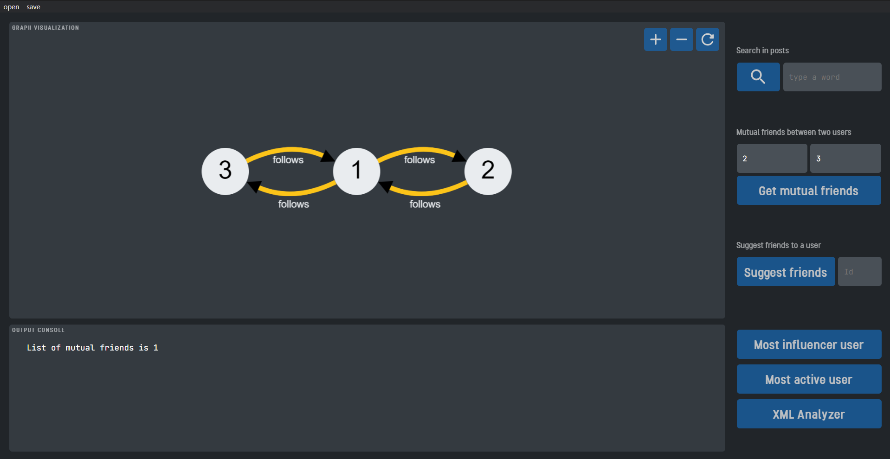

# XML/Social-Network analyzer
## XML Formatter and Social Network Analyzer cross-platform desktop application 

**This application is divided into two phases:**

- **XML formatter** which takes an XML file and do various operations:  
`validate`, `correct`, `compress`, `decompress`, `convert to JSON`, `minify`, and  `prettify `

- **Social Network Analysis** which takes the social network data written in XML format from the previous phase and do various operations:  
`graph visualization`, `search in posts`, `get mutual users`, `most active user`, `most influencer user`, `suggest friends`    


### GUI Manual

#### **Menu bar**
  - open    
  
`XML file` opens XML file  
`Compressed file` opens a compressed .tkf file

  - save    
  
 `save as` saves the content of the output window in the XML (.tkf or .json) in file system


#### **XML Analyzer**    



- `Validate` validates the XML in the input window and shows errors if found in output window
- `Correct` correct errors shown in validate
- `Prettify` prettifies the XML data in the input window
- `Minify` minified the input data in the input window
- `To JSON`  takes XML data from input window  
  + `compact` shows a compact JSON in output window  
  + `non-compact` shows non-compact JSON in output window [**reference**](https://github.com/nashwaan/xml-js#synopsis)
- `Compress` compresses the XML data and shows in output window (.tkf)
- `Decompress` takes compressed data and shows it as prettified XML in output window
- `SN analyzer` takes the valid XML data and goes to the next phase

#### **Social Network Analyzer**




- `Search in posts` case insensitive search in users posts
- `Get Mutual Friends` get the mutual users that two users follow
- `Suggest friends` suggest users to follow based on mutual based on users you follow and follow you
- `Most influencer user` gets the most followed user
- `Most active user` gets the users who followed the most users
- `XML Analyzer` moves back to the previous phase


### Application diagram


This figure describes every operation done in this app, when a user wants to perform any operation on XML data the following sequence happens:
1. the user type (or open) XML data and press any command button
2. the command is sent to the `main` function which read the command and direct it to the corresponding handler
3. the `handler` is responsible for ensuring that the given data is compatible with the `feature` function, then send the data to the corresponding feature function
4. the `feature` function is the core of the program that performs the actual work on the data, then send the result back to the `handler`
5. the `handler` send the response back to the `GUI` to be displayed to the user


### How to install and build
For trying the project you can download the pre-build copy for windows platform from [**here**](https://drive.google.com/file/d/1m7Ncw1HG-fxiy88DPQtDH7_-VbWH8Y5o/view?usp=share_link) or clone the repo and build your own copy   
For building your copy make sure you have node and npm installed on your machine, then follow these instructions
1. Clone the repo
   ``` 
   git clone https://github.com/Ahmed-Khaled24/XML-SN-Analyzer.git
    ```
2. Install project dependencies 
    ``` 
    npm install
    ```
3. For the building process there are two options
   + Use the pre-configured scripts in package.json 
     ```bash
     npm run win
     npm run linux
     npm run mac
     ```
     for windows, linux, and mac platforms respectively
   + Customize your build options using electron-builder  [**reference**](https://www.electron.build/)  


### Remarks
1.  comments and attributes are not supported
2. XML must have a single parent (wrapper tag) for compact json to work properly
3.  empty XML tags are ignored
3. #### social network XML must be formatted this way 
```XML 
<users>
    <user>
        <id> 1 </id>
        <name> Ahmed Ali </name>
        <posts>
            <post>
                <body>
                    Lorem ipsum dolor sit amet, 
                </body>
                <topics>
                    <topic>
                        economy
                    </topic>
                    <topic>
                        finance
                    </topic>
                </topics>
            </post>
        </posts>
        <followers>
            <follower>
                <id> 2 </id>
            </follower>
            <follower>
                <id> 3 </id>
            </follower>
        </followers>
    </user>
</users>
```
- List of `users`  
  - each `user` must have an `id` and `name` , may have `followers` and `posts`  
  - each `follower` has an `id`  
  - each `post` has `body` and `topics`
